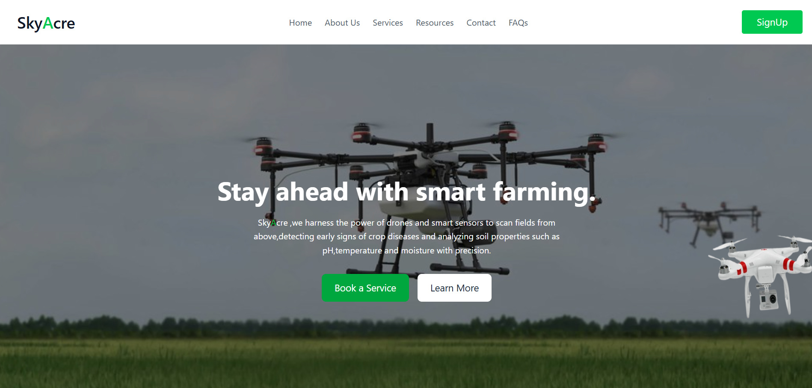
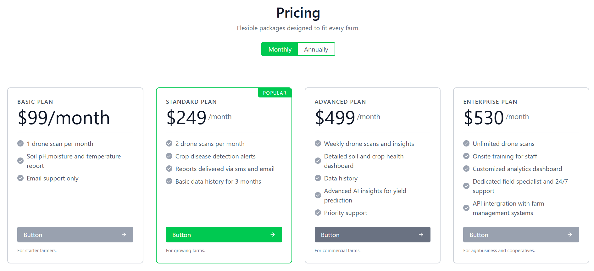
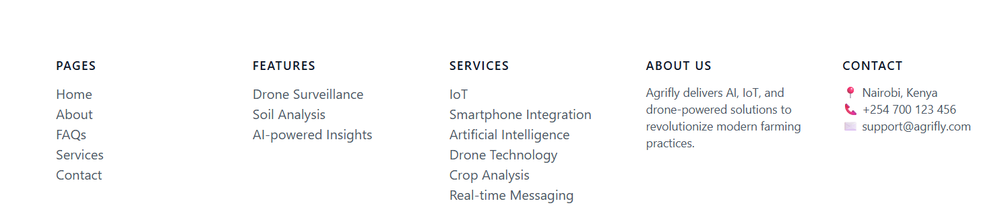
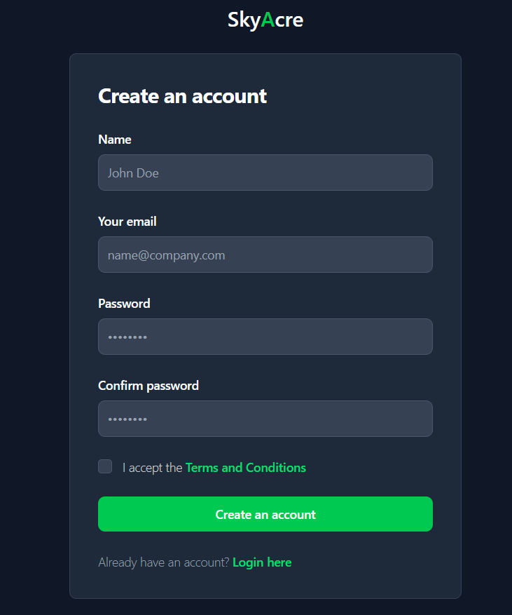

# SkyAcre Frontend




## Overview

SkyAcre is a modern web application built for precision agriculture, leveraging drone technology and AI-powered analytics to help farmers optimize their operations. The frontend provides a user-friendly interface for farmers, administrators, and potential clients to access services, learn about the platform, and manage their agricultural data.

The application is designed as a single-page application (SPA) with multiple user roles, featuring a public landing site and role-based dashboards.

## Tech Stack

- **Framework**: React 19 with Vite for fast development and building
- **Styling**: Tailwind CSS for utility-first CSS framework
- **Routing**: React Router DOM for client-side routing
- **Animations**: Framer Motion for smooth UI animations and transitions
- **HTTP Client**: Axios for API communications
- **Notifications**: React Toastify for user notifications
- **Loading Indicators**: React Spinners for loading states
- **Icons**: React Icons for consistent iconography
- **Build Tool**: Vite with ESLint for code linting

## Code Structure

### Directory Layout

```
Frontend/
├── src/
│   ├── Components/          # Reusable UI components
│   ├── Pages/               # Page-level components
│   │   ├── PublicPage/      # Public-facing pages
│   │   ├── Farmers/         # Farmer dashboard
│   │   └── Admins/          # Admin dashboard (under development)
│   ├── assets/              # Static assets (images, icons)
│   ├── App.jsx              # Main application component with routing
│   ├── main.jsx             # Application entry point
│   └── index.css            # Global styles
├── public/                  # Public static files
├── package.json             # Dependencies and scripts
├── vite.config.js           # Vite configuration
├── tailwind.config.js       # Tailwind CSS configuration
└── eslint.config.js         # ESLint configuration
```

### Key Components

- **Navbar**: Navigation bar with links to main sections
- **Hero**: Landing page hero section with call-to-action buttons
- **Features**: Showcase of platform capabilities (drone surveillance, soil analysis, AI insights)
- **ServicesProvided**: Grid of available agricultural services
- **HowItWorks**: Step-by-step process explanation
- **Pricing**: Service pricing plans
- **Gallery**: Visual showcase of drone operations
- **Team**: Team member profiles
- **Testimonials**: Customer reviews and feedback
- **Footer**: Site footer with links and contact info
- **SignUp**: User registration form
- **Spinner**: Loading indicator component

### Pages

- **Home**: Main landing page combining multiple components
- **AboutUs**: Company information and mission
- **Services**: Detailed services page with hero, gallery, and pricing
- **PricingPlans**: Dedicated pricing information
- **Contact**: Contact form and information
- **FAQ**: Frequently asked questions
- **Blog**: Resources and blog posts
- **Farmer**: Farmer dashboard (currently shows welcome message and data preparation)
- **Admin**: Admin dashboard (placeholder, not implemented)

## Application Workflow

### Public User Journey

1. **Landing**: Users arrive at the home page featuring a hero section with background image and call-to-action buttons
2. **Exploration**: Navigate through features, services, and how-it-works sections to understand the platform
3. **Learning**: Access detailed information via About, FAQ, and Blog pages
4. **Service Discovery**: View available services including aerial monitoring, pesticide spraying, irrigation analysis, etc.
5. **Pricing Review**: Check pricing plans for different service tiers
6. **Contact**: Reach out via contact form for inquiries
7. **Registration**: Sign up for an account to access personalized features

   

### Farmer Workflow

1. **Authentication**: Farmers log in (authentication handled by backend)
2. **Dashboard Access**: Redirected to `/farmer` route
3. **Data Preparation**: System prepares farmer-specific data and AI recommendations
4. **AI Integration**: Connects with backend AI models for crop and fertilizer recommendations based on soil data, weather, and historical performance

### Admin Workflow

- Admin dashboard is currently a placeholder and not fully implemented
- Future implementation will include user management, service monitoring, and analytics

## Key Features

### Visual Design

- Responsive design optimized for desktop and mobile devices
- Green color scheme reflecting agricultural theme
- Animated drone element that randomly moves across the screen for visual interest
- Smooth transitions and hover effects throughout the UI

### User Experience

- Intuitive navigation with clear call-to-action buttons
- Loading states and user feedback via spinners and toast notifications
- Breadcrumb navigation for better orientation
- Gallery sections showcasing real-world applications

### Technical Features

- Client-side routing with React Router
- Component-based architecture for maintainability
- Utility-first styling with Tailwind CSS
- Animation library integration for enhanced interactivity
- API-ready structure for backend integration

## Integration Points

- **Backend API**: Axios is configured for HTTP requests to the backend server
- **AI Models**: Frontend serves as the interface for AI-powered crop and fertilizer recommendations
- **Authentication**: User registration and login handled through backend services
- **Data Visualization**: Prepared for displaying AI-generated insights and reports

## Development Workflow

- **Development**: `npm run dev` starts the Vite development server
- **Building**: `npm run build` creates optimized production build
- **Linting**: `npm run lint` runs ESLint for code quality checks
- **Preview**: `npm run preview` serves the built application locally

## Future Enhancements

- Complete admin dashboard implementation
- Enhanced farmer dashboard with data visualization
- Real-time monitoring features
- Mobile application development
- Integration with IoT sensors and additional drone capabilities

This frontend application serves as the user-facing component of the SkyAcre precision agriculture platform, providing an intuitive and engaging experience for modern farmers adopting smart farming technologies.
