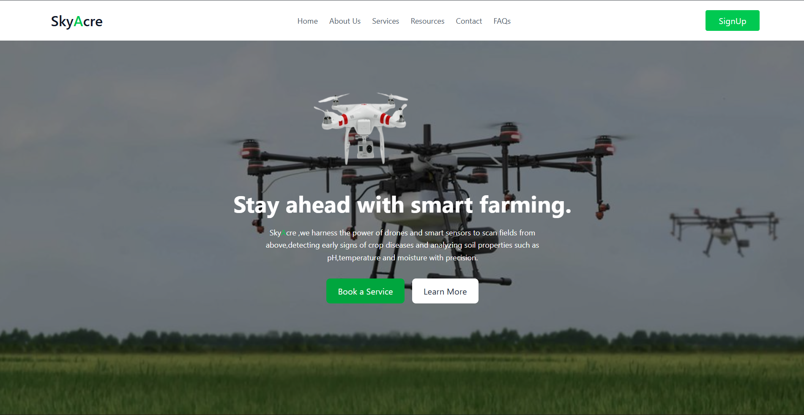

# SkyAcre: Revolutionizing Agriculture with AI-Powered Insights



Welcome to **SkyAcre**, the ultimate agricultural platform that harnesses the power of artificial intelligence, modern web technologies, and intuitive design to transform farming practices. By minimizing waste through precise resource allocation and optimizing yields, SkyAcre not only boosts farmer profitability but also enhances global food access by promoting sustainable, efficient agriculture. Whether you're a seasoned farmer or just starting out, SkyAcre empowers you to make data-driven decisions that maximize productivity while reducing environmental impact.

## What Makes SkyAcre Special?

SkyAcre is a comprehensive ecosystem built to bridge the gap between traditional farming and cutting-edge technology. Our platform combines:

- **Intelligent AI Recommendations**: Leverage machine learning models to get personalized crop and fertilizer suggestions based on soil conditions, nutrient levels, pH, rainfall, temperature, and regional data. Say goodbye to guesswork and hello to optimized yields!
- **Seamless User Experience**: A stunning, responsive React-based frontend with smooth animations, easy navigation, and a user-friendly interface. Explore services, pricing plans, resources, and more—all designed with farmers in mind.
- **Robust Backend Infrastructure**: Powered by Node.js and MongoDB, our secure backend handles user management, real-time data processing, and seamless integration with AI services. Plus, automated email notifications keep you informed every step of the way.
- **Scalable Architecture**: From microservices for AI predictions to modular components for extensibility, SkyAcre is built for growth. Future integrations with IoT devices promise even smarter farming solutions.

## Key Features

- **Crop & Fertilizer Prediction**: Input your farm's details and receive instant, AI-generated recommendations for the best crops and fertilizers tailored to your land, minimizing waste and optimizing resource use.
- **User Dashboard**: Manage your profile, track predictions, and access exclusive resources in a dedicated farmer portal.
- **Comprehensive Services**: Discover a range of agricultural services designed to reduce waste and improve efficiency, including:
  - Aerial Crop Monitoring with NDVI and multispectral imaging for precise disease detection
  - Pesticide & Fertilizer assesment and recommendations via drones, targeting applications to reduce chemical waste
  - Irrigation Analysis to detect dry zones and optimize water usage
  - Soil & Plant Health Mapping for nutrient deficiency identification
  - Field Survey & 3D Mapping for accurate land management
  - Data-Driven Insights with AI analytics for smarter decision-making
- **Community & Resources**: Stay updated with blogs, FAQs, and testimonials from fellow farmers.
- **Secure & Reliable**: End-to-end encryption, CORS-enabled APIs, and robust error handling ensure your data is safe and the platform runs smoothly.

## Tech Stack

- **Frontend**: React, Vite, Tailwind CSS, Framer Motion for animations, React Router for navigation, Axios for API calls, React Toastify for notifications
- **Backend**: Node.js, Express, MongoDB, Mongoose for database management, Nodemailer for email services, Multer for file uploads, Cookie Parser for session handling
- **AI & ML**: Python, Flask, Scikit-Learn (Decision Tree Classifier), Joblib for model serialization, Pandas/Numpy for data processing
- **Additional Tools**: CORS for cross-origin requests, Dotenv for environment variables
- **IoT Integration**: Planned support for Internet of Things devices for real-time field monitoring and data collection

## AI Model Details

SkyAcre's AI engine is powered by a Decision Tree Classifier trained on a comprehensive dataset of crop and fertilizer recommendations. By analyzing key environmental and soil features, the model delivers precise recommendations that minimize agricultural waste and optimize resource allocation, directly contributing to improved food access through sustainable farming practices. Key features include:

- Region and Soil Color (encoded categorically)
- Nutrient levels: Nitrogen, Phosphorus, Potassium
- Soil pH
- Rainfall and Temperature

The model predicts optimal crops and fertilizers with high accuracy, providing farmers with actionable insights to maximize yields while reducing overuse of fertilizers and water. Trained on real-world data, it achieves strong performance metrics for both crop and fertilizer classification, ensuring efficient and eco-friendly agriculture.

## Installation & Setup

### Prerequisites

- Node.js (v16 or higher)
- Python (v3.8 or higher)
- MongoDB (local or cloud instance)
- Git

### Backend Setup

1. Navigate to the Backend directory:
   ```bash
   cd Backend
   ```
2. Install dependencies:
   ```bash
   npm install
   ```
3. Create a `.env` file with the following variables:
   ```
   MONGO_URL=your_mongodb_connection_string
   EMAIL_USER=your_email@gmail.com
   EMAIL_PASS=your_email_password
   PORT=3000
   ```
4. Start the server:
   ```bash
   npm run server
   ```

### Frontend Setup

1. Navigate to the Frontend directory:
   ```bash
   cd Frontend
   ```
2. Install dependencies:
   ```bash
   npm install
   ```
3. Start the development server:
   ```bash
   npm run dev
   ```

### AI Models Setup

1. Navigate to the AI-Models directory:
   ```bash
   cd AI-Models
   ```
2. Create a virtual environment:
   ```bash
   python -m venv venv
   venv\Scripts\activate  # On Windows
   ```
3. Install dependencies:
   ```bash
   pip install -r requirements.txt
   ```
4. Run the Flask API:
   ```bash
   python app.py
   ```

## Usage

1. **User Registration**: Sign up on the platform to access personalized features.
2. **Explore Services**: Browse available agricultural services and book consultations.
3. **AI Predictions**: As a registered farmer, input your field data to receive crop and fertilizer recommendations.
4. **Dashboard Access**: Monitor your predictions and manage your profile.

## API Endpoints

### User Management

- `POST /user/register` - Register a new user
- `GET /user/users` - Retrieve all users (admin)
- `GET /user/:id` - Get user by ID
- `PUT /user/:id` - Update user information

### Farmer Predictions

- `POST /farmer/predict` - Get crop and fertilizer recommendations

### AI Microservice

- `POST /farmer/predict` (Flask) - Direct AI prediction endpoint

## Contributing

We welcome contributions! Please follow these steps:

1. Fork the repository
2. Create a feature branch: `git checkout -b feature-name`
3. Commit your changes: `git commit -m 'Add feature'`
4. Push to the branch: `git push origin feature-name`
5. Submit a pull request

## License

This project is licensed under the ISC License - see the LICENSE file for details.

## Why Choose SkyAcre?

In an era where technology is reshaping industries, agriculture deserves its spotlight. SkyAcre isn't just an app—it's a movement towards smarter, greener farming that minimizes waste and enhances global food access. By optimizing resource use and increasing yields sustainably, we help bridge the gap between production and consumption, ensuring more people have access to nutritious food. Join thousands of farmers who are already reaping the benefits of data-driven agriculture. Boost your harvests, reduce waste, and contribute to a sustainable future—all with the click of a button.

Ready to elevate your farming game? Dive into SkyAcre today and watch your fields flourish!

**Built with passion for farmers, by innovators in tech***.*
